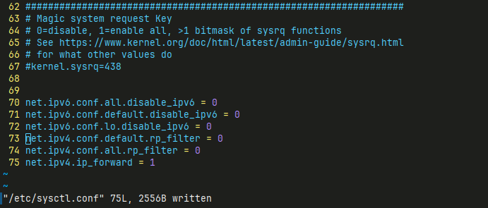
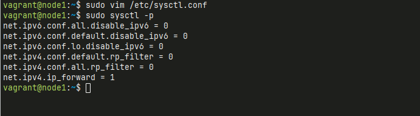

# Installation

DevStack will clone the OpenStack source code from the official OpenStack repository, which is hosted on OpenDev (formerly known as Gerrit). The URL for cloning the OpenStack repositories is:

```
https://opendev.org/openstack
```


DevStack, during its setup and installation process, automatically clones the relevant OpenStack services from this repository. The `devstack` script will perform the following steps:

1. **Clone the OpenStack repository**: DevStack clones the OpenStack source code into the directory where it is installed.
2. **Install required dependencies**: It installs dependencies such as Python packages, libraries, and tools that are required to run OpenStack services.
3. **Configure services**: DevStack configures OpenStack services (such as `keystone`, `nova`, `glance`, `neutron`, etc.) based on the configuration specified in the `local.conf` file.
4. **Start services**: After configuring, DevStack will start the OpenStack services on the system.

By default, the main OpenStack repositories (such as `nova`, `keystone`, `glance`, `neutron`, etc.) are cloned from **https://opendev.org/openstack**, and these repositories contain the code for the OpenStack services that you deploy in your environment.

If you want to manually update or clone a specific repository, you can also browse the official OpenStack Git repositories at **https://opendev.org/openstack**.


## Disble IPV6
- Step 1 Open the file in a text editor, e.g., sudo vim /etc/sysctl.conf, and add the following lines to disable IPv6, set up reverse path filtering, and enable IPv4 forwarding: (append to end of files)

    ``` bash
    $ sudo vim /etc/sysctl.conf
    ```
    content:
    ``` bash
    net.ipv6.conf.all.disable_ipv6 = 0
    net.ipv6.conf.default.disable_ipv6 = 0
    net.ipv6.conf.lo.disable_ipv6 = 0
    net.ipv4.conf.default.rp_filter = 0
    net.ipv4.conf.all.rp_filter = 0
    net.ipv4.ip_forward = 1
    ```
    

- Step 2 Apply the Changes:
    - After saving the file, apply the settings with the following command:
    ``` bash
    $ sudo sysctl -p
    ```
    

## Create Stack User
- Step 3 Prepare the system
DevStack works best on a fresh installation of a supported Linux distribution, like Ubuntu 20.04 or CentOS/RHEL 8. Ensure your system meets these requirements:
    - Create a non-root user (e.g., stack) with sudo privileges:
    ``` bash
    $ sudo useradd -s /bin/bash -d /opt/stack -m stack
    $ sudo usermod -aG sudo stack
    $ echo "stack ALL=(ALL) NOPASSWD: ALL" | sudo tee /etc/sudoers.d/stack
    $ sudo chmod +x /opt/stack
    ```
    Switch to stack user:
    ``` bash
    $ sudo -u stack -i
    $ sudo apt update -y
    $ sudo apt upgrade -y

    ```
    **Explaination:**
    - This command uses sudo to switch to the stack user.
    - The -i flag simulates a full login, so it initializes the environment as if the stack user had logged in directly.
    - It respects the sudoers configuration (i.e., the specific privileges and restrictions set for the stack user).
    - The stack user’s environment variables (like HOME and PATH) and login shell are loaded, providing a clean environment.

## Clone Source Code and Run
- Step 4 Clone the DevStack Repository:

    ``` bash
    $ git clone https://opendev.org/openstack/devstack
    $ cd devstack
    ```

    Create local.conf inside devstack folder
```
cat <<EOF >> local.conf
[[local|localrc]]
IP_VERSION=4
SERVICE_IP_VERSION=4
TUNNEL_IP_VERSION=4
HOST_IP=192.168.121.168
SERVICE_HOST=192.168.121.168
MYSQL_HOST=192.168.121.168
RABBIT_HOST=192.168.121.168
GLANCE_HOSTPORT=192.168.121.168:9292
ADMIN_PASSWORD=secret
DATABASE_PASSWORD=\$ADMIN_PASSWORD
RABBIT_PASSWORD=\$ADMIN_PASSWORD
SERVICE_PASSWORD=\$ADMIN_PASSWORD
LOGFILE=/opt/stack/logs/stack.sh.log
FORCE=yes
EOF
```
!!! note "Change IP address to vm ip"

    - Change IP address from local.conf to VM ip
    - Change ADMIN_PASSWORD

- Step 5 Run the DevStack Installation:
```
$ ./stack.sh
```
This will take a 15 - 20 minutes, largely depending on the speed of your internet connection. Many git trees and packages will be installed during this process.


!!! note "Other command"

    - ./unstack.sh
    - ./clean.sh

- Step 6 Access the Openstack Dashboard
    - Open Browser
    ```
    http://YOUR_SERVER_IP/dashboard
    ```
    login with user admin and password specified in ADMIN_PASSWORD in local.conf

- Step 7 Verify the installation
    - to check if services are running
    ``` bash
    $ source openrc admin admin
    $ openstack service list
    ```