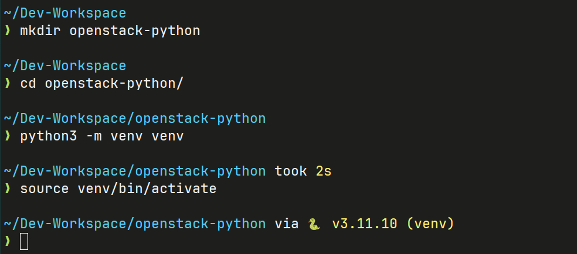

# Understand Python OOP

## Create python evironment and create project

```bash
mkdir openstack_python
cd openstack_python
python3 -m venv venv
source venv/bin/active
```



!!! info "How to activate python envinronment in windows"

    windows run   venv\Scripts\activate

```py title="python_lab1.py"

# Define the Car class
# Define the Car class
from datetime import datetime

class Car:
    def __init__(self, make: str, model: str, year: int, color: str) -> None:
        self.make: str = make
        self.model: str = model
        self.year: int = year
        self.color: str = color

    def display_info(self) -> None:
        print(f"{self.year} {self.color} {self.make} {self.model}")

    def repaint(self, new_color: str) -> None:
        self.color = new_color
        print(f"The car has been repainted to {self.color}.")

    def car_age(self) -> int:
        current_year = datetime.now().year
        return current_year - self.year

    def print_self(self) -> None:
        print(f"{self}")

# Create an instance of Car with type annotation
my_car: Car = Car(make="Toyota", model="Camry", year=2020, color="Red")

# Display the car's information
my_car.display_info()

# Use the car's methods
my_car.repaint("Blue")
print(f"The car is {my_car.car_age()} years old.")

my_car.print_self()

print(my_car)

```

**Constructor** (`__init__` method): This special method is called when an object is created. It is used to initialize the object’s attributes.

!!! info "Class is blueprint"

    a class is a blueprint for creating objects. Classes define the attributes (data) and methods (functions) that the objects created from the class will have.

## What Happens if You print(self)?

```
my_car.repaint("Blue")
print(my_car)

<__main__.Car object at 0x7f7e20e13cd0>
<__main__.Car object at 0x7f7e20e13cd0>
```

!!! info "self is address in memory"

    This output shows the memory address where the instance is stored, along with the class name. This representation is the default string representation of the object, and it might look cryptic.

---

## Benefits of Using Classes

1 **Encapsulation**: Classes allow grouping of related data and functions together, making the code modular and easier to understand.  
2 **Reusability**: Once defined, classes can be used multiple times to create different objects.  
3 **Inheritance**: A class can inherit attributes and methods from another class, allowing you to create a hierarchy of classes.  
4 **Polymorphism**: Classes allow for different classes to have methods with the same name but different implementations, providing flexibility in design.

## Polymorphism with Class Methods

Polymorphism allows us to define a method in different classes that performs similar operations but with different implementations. For example, we might have a method called speak in different animal classes that each produce a different sound.

```py title="python_lab2.py"

class Dog:
    def speak(self) -> None:
        print("Woof!")

class Cat:
    def speak(self) -> None:
        print("Meow!")

class Cow:
    def speak(self) -> None:
        print("Moo!")

# We can use polymorphism to call the speak method on different objects
animals = [Dog(), Cat(), Cow()]

for animal in animals:
    animal.speak()  # Output: Woof!, Meow!, Moo!

```

## Polymorphism with Inheritance and Method Overriding

```py title="python_lab3.py"
from math import pi

# parent class
class Shape:
    def area(self) -> float:
        raise NotImplementedError("Subclasses should implement this!")

# child class
class Circle(Shape):
    def __init__(self, radius: float) -> None:
        self.radius = radius

    def area(self) -> float:
        return pi * (self.radius ** 2)

# child class
class Square(Shape):
    def __init__(self, side: float) -> None:
        self.side = side

    def area(self) -> float:
        return self.side * self.side

# Using polymorphism to calculate area
shapes = [Circle(3), Square(4)]

for shape in shapes:
    print(shape.area())  # Output: 28.27 for Circle, 16 for Square

```

## Polymorphism with Functions and Objects

You can also use polymorphism by passing different types of objects to the same function. This can be useful when you have different classes that implement a similar method, and you want to call that method in the function regardless of the specific class.

```py title="python_lab3.py"

class Bird:
    def fly(self) -> None:
        print("Bird flies.")

class Airplane:
    def fly(self) -> None:
        print("Airplane flies.")

class Superman:
    def fly(self) -> None:
        print("Superman flies.")

def make_it_fly(entity) -> None:
    entity.fly()

# Passing different types of objects with a common fly method
make_it_fly(Bird())       # Output: Bird flies.
make_it_fly(Airplane())   # Output: Airplane flies.
make_it_fly(Superman())   # Output: Superman flies.


```

**Summary:**

- The make_it_fly function expects an object that has a fly method. It doesn’t care what specific class the object is from.
- As long as the object passed has a fly method, the function will work, demonstrating polymorphism through a common interface.

---

## Inheritance in python

Inheritance in Python allows a class (called a subclass or child class) to inherit attributes and methods from another class (called a superclass or parent class). This promotes code reuse and the creation of hierarchies.

**The child class can:**

- Inherit methods and attributes from the parent class.
- Override methods to provide its own behavior.
- Add new methods and attributes.

```py title="python_lay5.py"
# inheritance
class Vehicle:
    def __init__(self, brand: str, model: str) -> None:
        self.brand = brand
        self.model = model

    def start(self) -> None:
        print(f"The {self.brand} {self.model} is starting.")

    def stop(self) -> None:
        print(f"The {self.brand} {self.model} is stopping.")

# Child class inherits from Vehicle
class Car(Vehicle):
    def __init__(self, brand: str, model: str, doors: int) -> None:
        super().__init__(brand, model)  # Call the parent class constructor
        self.doors = doors

    def honk(self) -> None:
        print("Beep! Beep!")


# Creating an instance of the Car class
my_car = Car("Toyota", "Corolla", 4)

# Accessing methods from the parent (Vehicle) class
my_car.start()   # Output: The Toyota Corolla is starting.
my_car.stop()    # Output: The Toyota Corolla is stopping.

# Accessing method from the Car class
my_car.honk()    # Output: Beep! Beep!

```

!!! note "super() is built-in function"

    super() is a built-in function that allows you to call a method from a parent class (also known as a superclass) from within a method in a subclass.

```py title="python_lab6.py"

class A:
    def __init__(self):
        print("A initialized")

class B(A):
    def __init__(self):
        super().__init__()  # Calls A's __init__
        print("B initialized")

class C(A):
    def __init__(self):
        super().__init__()  # Calls A's __init__
        print("C initialized")

class D(B, C):
    def __init__(self):
        super().__init__()  # Calls B's __init__ (because B is before C in the MRO)
        print("D initialized")

# Creating an instance of D
d = D()

```

Result:

```
A initialized
C initialized
B initialized
D initialized
```

## Overide method by Child

```py title="python_lab7.py"
class Vehicle:
    def __init__(self, brand: str, model: str) -> None:
        self.brand = brand
        self.model = model

    def start(self) -> None:
        print(f"The {self.brand} {self.model} is starting.")

    def stop(self) -> None:
        print(f"The {self.brand} {self.model} is stopping.")

# Child class inherits from Vehicle
class Car(Vehicle):
    def __init__(self, brand: str, model: str, doors: int) -> None:
        super().__init__(brand, model)  # Call the parent class constructor
        self.doors = doors

    def honk(self) -> None:
        print("Beep! Beep!")


    def start(self) -> None:
        print(f"The {self.brand} {self.model} with {self.doors} doors is starting in a new way!")

# Creating an instance of Car
my_new_car = Car("Honda", "Civic", 4)

# The start method is overridden in Car, so it uses the new implementation
my_new_car.start()   # Output: The Honda Civic with 4 doors is starting in a new way!
```

## Method of Class

In Python, a method is a function defined inside a class that operates on instances of that class. Methods allow objects created from the class to perform actions, modify attributes, or return information related to the object. There are several types of methods commonly used in classes:

1 **Instance Methods:** These work with a specific instance of a class and typically modify or return information specific to that instance.  
2 **Class Methods:** These are used on the class itself, rather than on instances of the class, and are often used to create alternative constructors.  
3 **Static Methods:** These don’t modify class or instance data but are related to the class in terms of functionality. They behave like regular functions but are logically grouped within the class.

### 1 Instance Methods

Instance methods are the most common type of method. They operate on a single instance of a class and typically modify or access the instance's attributes. Instance methods always take self as the first parameter, which represents the instance of the class that is calling the method.

```py title="python_lab8"
# Instance Methods
class Person:
    def __init__(self, name: str, age: int) -> None:
        self.name = name
        self.age = age

    # Instance method
    def introduce(self) -> None:
        print(f"Hello, my name is {self.name} and I am {self.age} years old.")

    # Instance method that modifies an attribute
    def have_birthday(self) -> None:
        self.age += 1  # Increase age by 1
        print(f"Happy Birthday! I am now {self.age} years old.")

# Creating an instance and calling instance methods
person1 = Person("Alice", 30)
person1.introduce()      # Output: Hello, my name is Alice and I am 30 years old.
person1.have_birthday()  # Output: Happy Birthday! I am now 31 years old.

```

### 2 Class Methods

Class methods operate on the class itself rather than on instances. They are often used as factory methods to create instances in a specific way. Class methods are defined using the @classmethod decorator, and they take cls (short for class) as the first parameter instead of self.

```py title="python_lab9"
# Class Methods

class Person:
    species = "Homo sapiens"  # Class attribute

    def __init__(self, name: str, age: int) -> None:
        self.name = name
        self.age = age

    @classmethod
    def create_baby(cls, name: str) -> "Person":
        # Class method to create a new instance with age 0
        return cls(name, age=0)

# Using the class method to create a baby person
baby = Person.create_baby("Charlie")
print(baby.name)  # Output: Charlie
print(baby.age)   # Output: 0

```

### 3 Static Methods

Static methods are utility methods that are related to the class but don’t require access to any instance-specific data or the class itself. They’re defined using the @staticmethod decorator and do not take self or cls as a parameter.

```py title="python_lab10"
# Static Method

class MathUtils:
    @staticmethod
    def add(a: int, b: int) -> int:
        return a + b

    @staticmethod
    def multiply(a: int, b: int) -> int:
        return a * b

# Calling static methods without creating an instance
print(MathUtils.add(5, 10))         # Output: 15
print(MathUtils.multiply(3, 7))     # Output: 21


```
