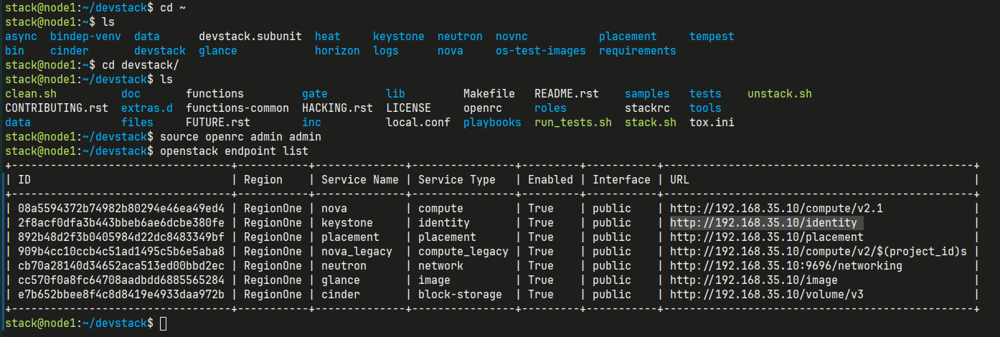
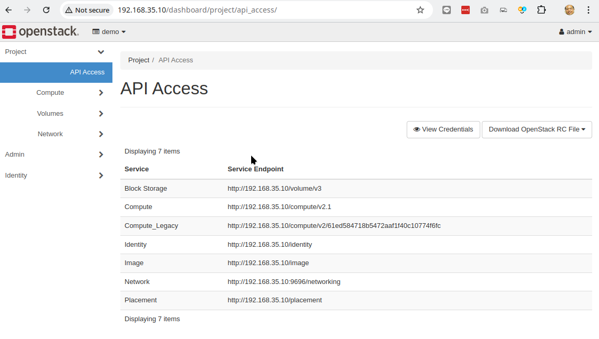
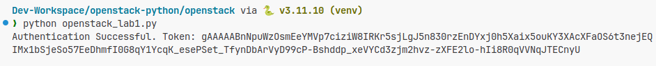
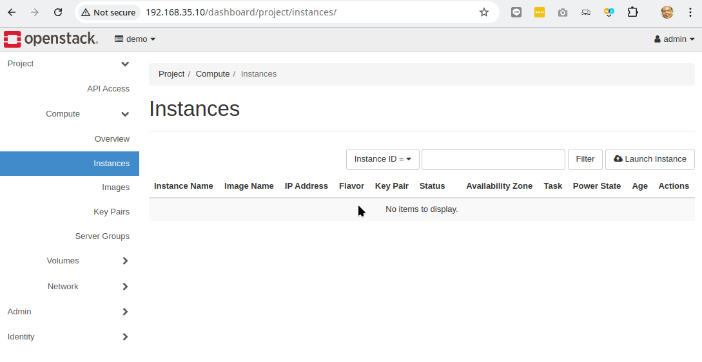
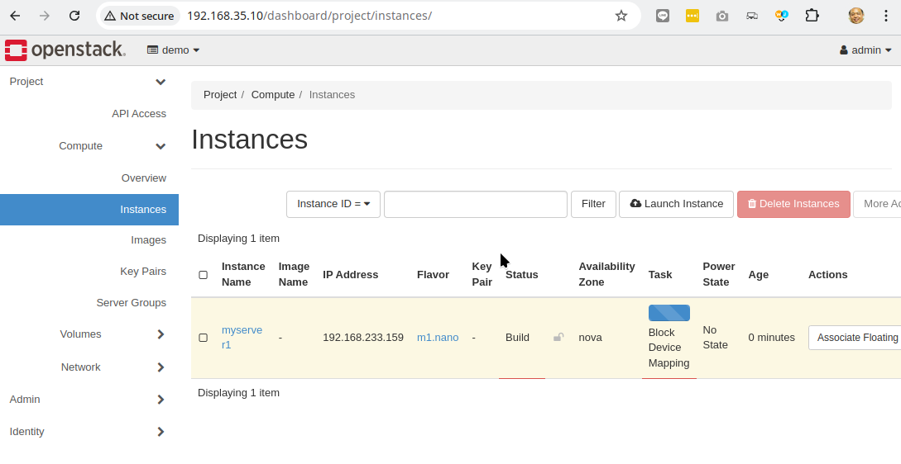
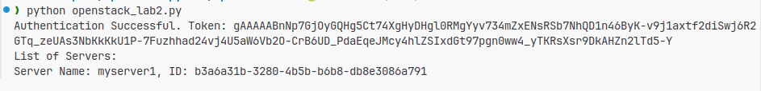
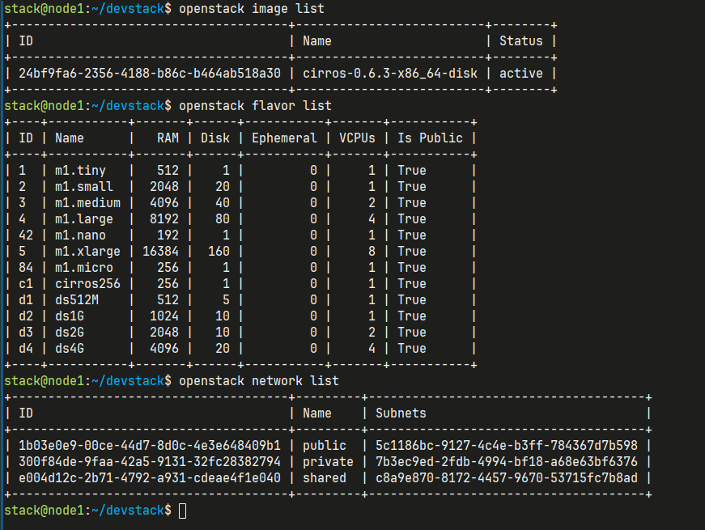

# Openstack RESTFULL API

```bash title="list endpoint"
source openrc admin admin
openstack endpoint list
```





using OpenStack, organizations can build private clouds with complete control over the underlying infrastructure and leverage a variety of powerful cloud computing services, all while being able to interact with the system through standard RESTful interfaces.

To interact with OpenStack services using Python, you can use Python's requests module to send RESTful API requests. OpenStack components expose their functionality via HTTP RESTful APIs, and you can automate or interact with OpenStack by sending HTTP requests to the relevant API endpoints.

```
mkdir openstack
cd openstack

pip install requests
```

## keystone api port 5000

```py title="openstack_lab1.py"
import requests
import json

# Define the OpenStack Keystone endpoint and credentials
keystone_url = 'http://192.168.35.10/identity/v3/auth/tokens'
username = 'admin'
password = 'secret'
project_name = 'admin'
domain_name = 'default'
auth_payload = {
    "auth": {
        "identity": {
            "methods": ["password"],
            "password": {
                "user": {
                    "name": username,
                    "domain": {"name": domain_name},
                    "password": password
                }
            }
        },
        "scope": {
            "project": {
                "name": project_name,
                "domain": {"name": domain_name}
            }
        }
    }
}

# Send authentication request to Keystone
headers = {'Content-Type': 'application/json'}
response = requests.post(keystone_url, data=json.dumps(auth_payload), headers=headers)

# Check if authentication is successful
if response.status_code == 201:
    token = response.headers['X-Subject-Token']
    print(f"Authentication Successful. Token: {token}")
else:
    print(f"Authentication Failed. Status Code: {response.status_code}")

```

Test result:

```
python openstack_lab1.py
Authentication Successful. Token: gAAAAABnNpuWzOsmEeYMVp7ciziW8IRKr5sjLgJ5n830rzEnDYxj0h5Xaix5ouKY3XAcXFaOS6t3nejEQIMx1bSjeSo57EeDhmfI0G8qY1YcqK_esePSet_TfynDbArVyD99cP-Bshddp_xeVYCd3zjm2hvz-zXFE2lo-hIi8R0qVVNqJTECnyU
```



## Nova api port 5000

List of Compute Instances

```py title="openstack_lab1.py"
# Define the Nova API endpoint for listing servers (VMs)
nova_url = 'http://<nova-server>:8774/v2.1/servers'
headers = {
    'X-Auth-Token': token  # Use the token obtained from Keystone
}

# Send GET request to list the servers
response = requests.get(nova_url, headers=headers)

# Check if the request was successful
if response.status_code == 200:
    servers = response.json()['servers']
    print("List of Servers:")
    for server in servers:
        print(f"Server Name: {server['name']}, ID: {server['id']}")
else:
    print(f"Failed to fetch servers. Status Code: {response.status_code}")

```

## Create new virtual machine

create new virtualmachine

```py title="openstack_lab3.py"
import requests
import json

# Define the OpenStack Keystone endpoint and credentials
keystone_url = 'http://192.168.35.10/identity/v3/auth/tokens'
username = 'admin'
password = 'secret'
project_name = 'admin'
domain_name = 'default'
auth_payload = {
    "auth": {
        "identity": {
            "methods": ["password"],
            "password": {
                "user": {
                    "name": username,
                    "domain": {"name": domain_name},
                    "password": password
                }
            }
        },
        "scope": {
            "project": {
                "name": project_name,
                "domain": {"name": domain_name}
            }
        }
    }
}

# Send authentication request to Keystone
headers = {'Content-Type': 'application/json'}
response = requests.post(keystone_url, data=json.dumps(auth_payload), headers=headers)

# Check if authentication is successful
if response.status_code == 201:
    token = response.headers['X-Subject-Token']
    print(f"Authentication Successful. Token: {token}")
else:
    print(f"Authentication Failed. Status Code: {response.status_code}")


# Define the Nova API endpoint for listing servers (VMs)

nova_url = 'http://192.168.35.10/compute/v2.1/servers'
headers = {
    'X-Auth-Token': token  # Use the token obtained from Keystone
}

# Send GET request to list the servers
response = requests.get(nova_url, headers=headers)

# Check if the request was successful
if response.status_code == 200:
    servers = response.json()['servers']
    print("List of Servers:")
    for server in servers:
        print(f"Server Name: {server['name']}, ID: {server['id']}")
else:
    print(f"Failed to fetch servers. Status Code: {response.status_code}")


```

Test Result

```
❯ python openstack_lab2.py
Authentication Successful. Token: gAAAAABnNp0FwNVSRxlzlkL0Mib2lXM7xFppqzuegrWPZcH5tD8UvV6rPLBJXrFjB5Cp5Z7GyRXRbfjq4Zla_bTZkrQ9gKejviKyTZf_iGwJZ0VjBfWh5IjZVBi4diIF_iZYt4uTctkgC32J8sGqfVRP1p3lp6AxODG1BTnR605S73ATKDVHYgg
List of Servers:

```



Try to add some instance server:



Run python code again:

```bash title="list server"
❯ python openstack_lab2.py
Authentication Successful. Token: gAAAAABnNp7GjOyGQHg5Ct74XgHyDHgl0RMgYyv734mZxENsRSb7NhQD1n46ByK-v9j1axtf2diSwj6R2GTq_zeUAs3NbKkKkU1P-7Fuzhhad24vj4U5aW6Vb2O-CrB6UD_PdaEqeJMcy4hlZSIxdGt97pgn0ww4_yTKRsXsr9DkAHZn2lTd5-Y
List of Servers:
Server Name: myserver1, ID: b3a6a31b-3280-4b5b-b6b8-db8e3086a791
```



## Create Server

```py title="openstack_lab3.py"
import requests
import json

# Define the OpenStack Keystone endpoint and credentials
keystone_url = 'http://192.168.35.10/identity/v3/auth/tokens'
username = 'admin'
password = 'secret'
project_name = 'admin'
domain_name = 'default'
auth_payload = {
    "auth": {
        "identity": {
            "methods": ["password"],
            "password": {
                "user": {
                    "name": username,
                    "domain": {"name": domain_name},
                    "password": password
                }
            }
        },
        "scope": {
            "project": {
                "name": project_name,
                "domain": {"name": domain_name}
            }
        }
    }
}

# Send authentication request to Keystone
headers = {'Content-Type': 'application/json'}
response = requests.post(keystone_url, data=json.dumps(auth_payload), headers=headers)

# Check if authentication is successful
if response.status_code == 201:
    token = response.headers['X-Subject-Token']
    print(f"Authentication Successful. Token: {token}")
else:
    print(f"Authentication Failed. Status Code: {response.status_code}")


# Define the Nova API endpoint for creating a server
create_url = 'http://192.168.35.10/compute/v2.1'

# Define the server creation payload
server_payload = {
    "server": {
        "name": "myserver2",
        "imageRef": "24bf9fa6-2356-4188-b86c-b464ab518a30",  # Replace with the ID of the image to use
        "flavorRef": "1",  # Replace with the ID of the flavor to use
        "networks": [{"uuid": "e004d12c-2b71-4792-a931-cdeae4f1e040"}]  # Replace with the UUID of the network
    }
}

# Send POST request to create the server
response = requests.post(create_url, json=server_payload, headers={'X-Auth-Token': token})

# Check if the server creation was successful
if response.status_code == 202:
    server = response.json()['server']
    print(f"Server created successfully. Name: {server['name']}, ID: {server['id']}")
else:
    print(f"Failed to create server. Status Code: {response.status_code}")


```



## Conclusion

This tutorial provided a basic overview of how to interact with OpenStack services using Python and RESTful APIs. By obtaining an authentication token from Keystone and using it to access other services like Nova, you can automate tasks such as listing servers, creating new virtual machines, or managing resources within your OpenStack cloud.

You can extend this basic functionality to interact with other OpenStack services, like Cinder (block storage), Neutron (networking), and Swift (object storage), following a similar pattern of using authentication tokens and sending appropriate RESTful requests.
