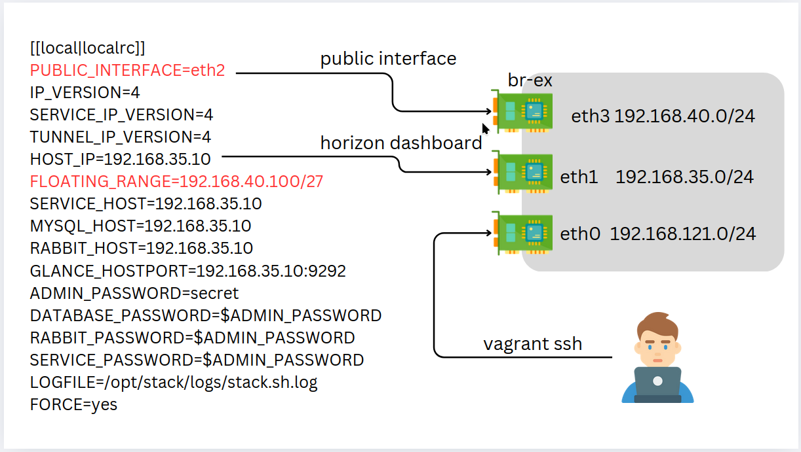
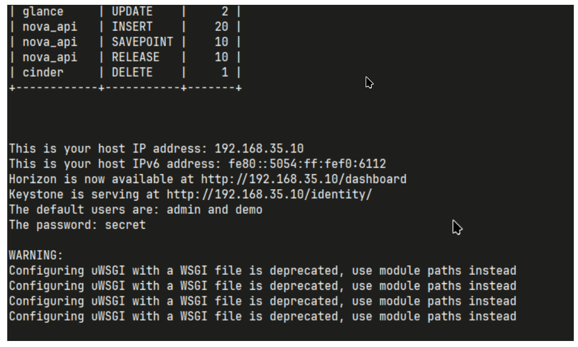
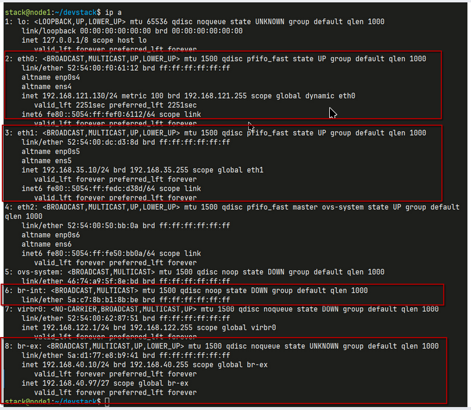
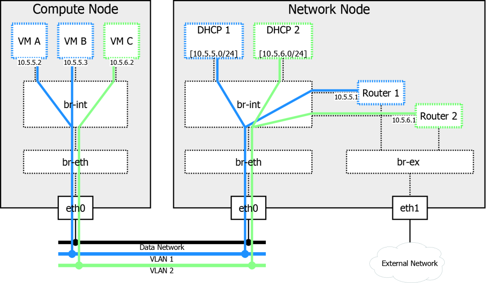

# Study public network

## เปลี่ยน Vagrantfile

```ruby title="add more interface"
# -*- mode: ruby -*-
# vi: set ft=ruby :

$script=<<-SCRIPT
    sed -i 's/PasswordAuthentication no/PasswordAuthentication yes/g' /etc/ssh/sshd_config
    systemctl restart ssh.service
SCRIPT
Vagrant.configure("2") do |config|

  config.vm.box = "generic/ubuntu2310"

  config.vm.define "node1" do |control|
    control.vm.hostname = "node1"
    control.vm.network "private_network", ip: "192.168.35.10"
    control.vm.network "private_network", ip: "192.168.40.10"
    control.vm.provider "virtualbox" do |vb|
      vb.memory = "8192"
      vb.cpus = 4
      vb.customize ["modifyvm", :id, "--nested-hw-virt", "on"]
    end
  end

  config.vm.define "node2" do |control|
    control.vm.hostname = "node2"
    control.vm.network "private_network", ip: "192.168.35.20"
    control.vm.network "private_network", ip: "192.168.40.20"
    control.vm.provider "virtualbox" do |vb|
      vb.memory = "8192"
      vb.cpus = 4
      vb.customize ["modifyvm", :id, "--nested-hw-virt", "on"]
    end
  end

  config.vm.provision "shell", inline: $script

end
```

## สั่งคำสั่ง สร้าง server

```bash title="vagrant up"
vagrant up
vagrant ssh node1
```

## kernel parameter

```
sudo vim /etc/sysctl.conf
```

```
net.ipv6.conf.all.disable_ipv6 = 0
net.ipv6.conf.default.disable_ipv6 = 0
net.ipv6.conf.lo.disable_ipv6 = 0
net.ipv4.conf.default.rp_filter = 0
net.ipv4.conf.all.rp_filter = 0
net.ipv4.ip_forward = 1
```

```
sudo sysctl -p
```

## เพิ่ม stack user

```bash title="create user"
$ sudo useradd -s /bin/bash -d /opt/stack -m stack
$ sudo chmod +x /opt/stack
```

## เพิ่ม สิทธิ์ sudo ให้แก่ user stack

```
$ echo "stack ALL=(ALL) NOPASSWD: ALL" | sudo tee /etc/sudoers.d/stack
$ sudo -u stack -i
```

## เปลี่ยน Repository ของ Ubuntu

```
$ sudo sed -i 's/mirrors.edge.kernel.org/old-releases.ubuntu.com/g' /etc/apt/sources.list
```

## Download โค้ด devstack

```
git clone https://opendev.org/openstack/devstack
cd devstack
vim local.conf
```

## สร้าง ไฟล์ local.conf

```
[[local|localrc]]
PUBLIC_INTERFACE=eth2
IP_VERSION=4
SERVICE_IP_VERSION=4
TUNNEL_IP_VERSION=4
HOST_IP=192.168.35.10
FLOATING_RANGE=192.168.40.100/27
SERVICE_HOST=192.168.35.10
MYSQL_HOST=192.168.35.10
RABBIT_HOST=192.168.35.10
GLANCE_HOSTPORT=192.168.35.10:9292
ADMIN_PASSWORD=secret
DATABASE_PASSWORD=$ADMIN_PASSWORD
RABBIT_PASSWORD=$ADMIN_PASSWORD
SERVICE_PASSWORD=$ADMIN_PASSWORD
LOGFILE=/opt/stack/logs/stack.sh.log
FORCE=yes
```



## เมื่อติดตั้ง เรียบร้อย



## รายละเอียด ของ network ip a



# ไฟล์ `localrc` สำหรับการติดตั้ง OpenStack (DevStack)

ไฟล์นี้กำหนดค่าพื้นฐานสำหรับการตั้งค่า OpenStack ผ่าน DevStack โดยเฉพาะในสภาพแวดล้อมสำหรับการพัฒนาหรือทดลองใช้งาน

## คำอธิบายค่าพารามิเตอร์

### การตั้งค่าเครือข่าย

- **`PUBLIC_INTERFACE=eth2`**  
  กำหนดชื่ออินเทอร์เฟซเครือข่ายที่ใช้สำหรับเชื่อมต่อเครือข่ายภายนอก (External Network)

- **`IP_VERSION=4`**, **`SERVICE_IP_VERSION=4`**, **`TUNNEL_IP_VERSION=4`**  
  ระบุการใช้ IPv4 สำหรับเครือข่าย:

  - การสื่อสารทั่วไป (IP Version)
  - การสื่อสารบริการ (Service IP)
  - การสื่อสารผ่าน tunnel (Tunnel IP)

- **`HOST_IP=192.168.35.10`**  
  ที่อยู่ IP ของโฮสต์ที่ใช้รัน DevStack

- **`FLOATING_RANGE=192.168.40.100/27`**  
  ช่วงที่อยู่ IP สำหรับ Floating IP เพื่อเชื่อมต่อ VM กับเครือข่ายภายนอก

### การตั้งค่าบริการ

- **`SERVICE_HOST=192.168.35.10`**  
  ระบุโฮสต์ที่ใช้รันบริการ OpenStack ทั้งหมด

- **`MYSQL_HOST=192.168.35.10`**  
  ระบุโฮสต์ที่ติดตั้งฐานข้อมูล MySQL

- **`RABBIT_HOST=192.168.35.10`**  
  ระบุโฮสต์ที่ติดตั้ง RabbitMQ (Message Queue)

- **`GLANCE_HOSTPORT=192.168.35.10:9292`**  
  ระบุ Endpoint ของ Glance สำหรับจัดการ Image

### การตั้งค่ารหัสผ่าน

- **`ADMIN_PASSWORD=secret`**  
  รหัสผ่านของผู้ดูแลระบบ (Admin)

- **`DATABASE_PASSWORD=$ADMIN_PASSWORD`**  
  รหัสผ่านสำหรับเข้าถึงฐานข้อมูล

- **`RABBIT_PASSWORD=$ADMIN_PASSWORD`**  
  รหัสผ่านสำหรับ RabbitMQ

- **`SERVICE_PASSWORD=$ADMIN_PASSWORD`**  
  รหัสผ่านสำหรับเข้าถึงบริการอื่น ๆ

### การจัดการ Logs และการบังคับติดตั้ง

- **`LOGFILE=/opt/stack/logs/stack.sh.log`**  
  ระบุไฟล์สำหรับบันทึก log ของ DevStack

- **`FORCE=yes`**  
  บังคับให้ DevStack ดำเนินการติดตั้งต่อแม้จะมีข้อผิดพลาดบางประการ

---

### อ้างอิง

- [DevStack Documentation](https://docs.openstack.org/devstack/latest/)

# ความสำคัญของ `br-ex` ใน OpenStack สำหรับ External Network

อุปกรณ์ **`br-ex`** หรือ **Bridge External** ใน OpenStack มีบทบาทสำคัญในการเชื่อมโยงระหว่างเครือข่ายภายในของ OpenStack และเครือข่ายภายนอก เช่น อินเทอร์เน็ตหรือเครือข่ายองค์กร

---

## ความสำคัญของ `br-ex`

1. **จัดการ Floating IP**

   - `br-ex` ช่วยให้ Virtual Machines (VMs) สามารถเข้าถึงเครือข่ายภายนอกได้โดยผ่าน Floating IP
   - Floating IP เป็น IP เสมือนที่ถูกกำหนดให้กับ VM เพื่อให้สามารถเข้าถึงได้จากภายนอก เช่น อินเทอร์เน็ต

2. **การกำหนดเส้นทาง (Routing)**

   - เส้นทางการรับส่งข้อมูลจาก External Network ถูกกำหนดผ่าน `br-ex` ไปยัง VM ผ่าน Neutron Service
   - สนับสนุนการใช้งานทั้ง IPv4 และ IPv6

3. **การเชื่อมต่อกับ Physical Interface**

   - `br-ex` ทำหน้าที่เป็นสะพานระหว่าง Virtual Bridge กับ Physical Interface จริง เช่น `eth2`
   - ช่วยให้ทราฟฟิกจากเครือข่ายจริงถูกส่งต่อไปยังระบบเสมือน

4. **บทบาทใน Network Node**
   - `br-ex` มักถูกใช้งานใน Network Node หรือ Controller Node เพื่อจัดการ External Network
   - เป็นส่วนสำคัญของโครงสร้างระบบ Networking ใน OpenStack

---

## วิธีการตั้งค่า `br-ex`

1. **สร้าง Virtual Bridge**  
   สร้าง `br-ex` ด้วยคำสั่ง `ovs-vsctl`:

   ```bash title="devstack ทำให้แล้ว"
   ovs-vsctl add-br br-ex
   ovs-vsctl add-port br-ex eth2
   ```

2. เชื่อมต่อกับ Neutron
   กำหนด External Network ให้เชื่อมต่อกับ br-ex ใน Neutron Configuration

3. การกำหนด Floating Range
   Floating IP ต้องถูกกำหนดในช่วงที่รองรับกับเครือข่ายภายนอก เช่น
   ```bash
   FLOATING_RANGE=192.168.40.100/27
   ```

# วิธีการคำนวณ Network Address จาก CIDR

## ขั้นตอนการคำนวณ Network Address

1. **แปลง IP Address เป็น Binary**

   - แปลงแต่ละส่วน (Octet) ของ IP Address ให้เป็นเลขฐานสอง
   - ตัวอย่าง:
     ```
     IP Address: 192.168.40.100
     Binary:     11000000.10101000.00101000.01100100
     ```

2. **แปลง Subnet Mask จาก CIDR เป็น Binary**

   - ใช้ค่า CIDR เพื่อระบุจำนวนบิตของ Subnet Mask
   - ตัวอย่าง `/27` หมายถึง 27 บิตแรกเป็น `1` และบิตที่เหลือเป็น `0`
     ```
     CIDR:        /27
     Subnet Mask: 11111111.11111111.11111111.11100000
     ```

3. **ทำ AND Operation ระหว่าง Binary ของ IP Address และ Subnet Mask**

   - ทำ AND (`1 AND 1 = 1`, `1 AND 0 = 0`, `0 AND 0 = 0`) ระหว่าง Binary ของ IP Address และ Subnet Mask
   - ตัวอย่าง:
     ```
     IP Address:     11000000.10101000.00101000.01100100
     Subnet Mask:    11111111.11111111.11111111.11100000
     Result:         11000000.10101000.00101000.01100000
     ```

4. **แปลงผลลัพธ์กลับเป็นเลขฐานสิบ**
   - แปลง Binary ผลลัพธ์กลับเป็นรูปแบบ Decimal
   - ตัวอย่าง:
     ```
     11000000.10101000.00101000.01100000 → 192.168.40.96
     ```

---

# ข้อมูลพื้นฐาน

### CIDR: `/27`

- หมายถึง Subnet Mask เท่ากับ `255.255.255.224` (27 บิตสำหรับ Network, เหลือ 5 บิตสำหรับ Host)
- จำนวน IP ทั้งหมดใน Subnet: \( 2^5 = 32 \)

### Network Address

- ใช้ค่าเริ่มต้นของช่วง IP ใน Subnet
- **192.168.40.96** (เป็น Network Address ของ Subnet ที่ครอบคลุม `192.168.40.100`)

### Broadcast Address

- ใช้ค่า IP สุดท้ายของช่วง Subnet
- **192.168.40.127**

### ช่วง IP ที่ใช้ได้ (Usable Range)

- ลบ Network Address และ Broadcast Address ออก
- **Usable Range**: `192.168.40.97` ถึง `192.168.40.126`

## สรุปตาราง ip

| **ประเภท**            | **ค่า**             |
| --------------------- | ------------------- |
| **Network Address**   | `192.168.40.96`     |
| **Subnet Mask**       | `255.255.255.224`   |
| **Broadcast Address** | `192.168.40.127`    |
| **Usable IP Range**   | `192.168.40.97-126` |
| **จำนวน IP ใช้ได้**   | `30 IP`             |

## br-ex ใน OpenStack: อธิบายอย่างละเอียด

br-ex เป็นชื่อของ bridge หรือ สวิตช์เสมือน หนึ่งใน OpenStack ซึ่งมีบทบาทสำคัญในการเชื่อมต่อเครือข่ายภายในของเครื่องเสมือน (VM) เข้ากับเครือข่ายภายนอก ในสภาพแวดล้อมของ OpenStack ที่ใช้ Open vSwitch (OVS) เป็นหลัก br-ex จะทำหน้าที่เป็นจุดเชื่อมต่อระหว่างพอร์ตเครือข่ายทางกายภาพ (physical network interface) และพอร์ตเครือข่ายเสมือนที่สร้างขึ้นสำหรับ VM ต่างๆ

**ทำไมถึงเรียกว่า br-ex?**

1. br: ย่อมาจาก bridge หรือ สวิตช์ ซึ่งเป็นอุปกรณ์เครือข่ายที่ใช้เชื่อมต่อหลายๆ เครือข่ายเข้าด้วยกัน
2. ex: อาจย่อมาจาก external หรือ exchange ซึ่งบ่งบอกว่า bridge นี้ทำหน้าที่เชื่อมต่อกับเครือข่ายภายนอก

**บทบาทหลักของ br-ex**

1. เชื่อมต่อเครือข่ายภายในกับภายนอก: br-ex จะเชื่อมต่อพอร์ตเครือข่ายทางกายภาพของเซิร์ฟเวอร์ที่ติดตั้ง OpenStack เข้ากับพอร์ตเครือข่ายเสมือนที่สร้างขึ้นสำหรับ VM ต่างๆ ทำให้ VM สามารถสื่อสารกับโลกภายนอกได้
2. จัดการการรับส่งข้อมูล: br-ex จะทำหน้าที่รับส่งข้อมูลระหว่าง VM ต่างๆ และระหว่าง VM กับเครือข่ายภายนอก โดยอาศัยหลักการทำงานของ bridge ในการตัดสินใจว่าจะส่งแพ็กเก็ตข้อมูลไปยังพอร์ตใด
3. สร้าง VLAN: br-ex สามารถใช้ในการสร้าง VLAN (Virtual Local Area Network) เพื่อแยกกลุ่มของ VM ออกจากกัน ทำให้แต่ละกลุ่มสามารถสื่อสารกันได้ภายในกลุ่มโดยไม่รบกวนกลุ่มอื่นๆ

**การทำงานของ br-ex (ในภาพรวม)**

- เมื่อมีการสร้าง VM ขึ้นมา OpenStack จะสร้างพอร์ตเครือข่ายเสมือนขึ้นมาหนึ่งพอร์ต และเชื่อมต่อพอร์ตนี้เข้ากับ br-ex
- แพ็กเก็ตข้อมูลที่ส่งมาจาก VM จะถูกส่งผ่าน br-ex ไปยังพอร์ตเครือข่ายทางกายภาพที่เชื่อมต่อกับสวิตช์ภายนอก
- แพ็กเก็ตข้อมูลที่ส่งมาจากเครือข่ายภายนอกจะถูกส่งผ่าน br-ex เข้าไปยังพอร์ตเครือข่ายเสมือนของ VM ที่เป็นปลายทาง

**สรุป**
br-ex เป็นองค์ประกอบสำคัญในสถาปัตยกรรมเครือข่ายของ OpenStack ที่ช่วยในการเชื่อมต่อและจัดการการรับส่งข้อมูลระหว่าง VM ต่างๆ และระหว่าง VM กับเครือข่ายภายนอก การทำความเข้าใจบทบาทของ br-ex จะช่วยให้ผู้ดูแลระบบสามารถแก้ไขปัญหาและปรับแต่งเครือข่ายของ OpenStack ได้อย่างมีประสิทธิภาพ

**br-ex แตกต่างจาก Bridge อื่นๆ ใน OpenStack อย่างไร**

br-ex เป็น bridge พิเศษใน OpenStack ที่มีบทบาทสำคัญในการเชื่อมต่อเครือข่ายภายในของเครื่องเสมือน (VM) เข้ากับเครือข่ายภายนอก โดยเฉพาะอย่างยิ่งในการส่งต่อ traffic จาก provider network ไปยัง physical network

เพื่อให้เข้าใจความแตกต่างได้ชัดเจนขึ้น ลองเปรียบเทียบ br-ex กับ bridge อื่นๆ ที่พบได้ทั่วไปใน OpenStack เช่น br-int และ br-tun

**br-ex vs. br-int**

- br-int: เป็น bridge ที่ใช้สำหรับเชื่อมต่อพอร์ตของ router (qg-xxx) เข้ากับ patch port ที่เชื่อมไปยัง br-ex ทำหน้าที่เป็นตัวกลางในการรับส่ง traffic ระหว่าง network provider กับ network tenant
- br-ex: ทำหน้าที่เชื่อมต่อ patch port จาก br-int เข้ากับพอร์ตทางกายภาพ (physical port) เพื่อส่ง traffic ออกไปยังเครือข่ายภายนอก

**br-ex vs. br-tun**

- br-tun: ใช้สำหรับการสร้าง tunnel หรืออุโมงค์สำหรับการสื่อสารระหว่าง node ต่างๆ โดยเฉพาะอย่างยิ่งในกรณีที่ต้องการสร้างเครือข่าย overlay
- br-ex: ไม่ได้เกี่ยวข้องโดยตรงกับการสร้าง tunnel แต่มีหน้าที่ในการส่งต่อ traffic ที่ผ่าน tunnel มาแล้วไปยังเครือข่ายภายนอก
  สรุป: br-tun เน้นเรื่องการสร้าง tunnel สำหรับการสื่อสารระหว่าง node ขณะที่ br-ex เน้นเรื่องการส่งต่อ traffic ออกไปยังเครือข่ายภายนอก

| Bridge | หน้าที่หลัก                               | เชื่อมต่อกับ                            |
| ------ | ----------------------------------------- | --------------------------------------- |
| br-ex  | เชื่อมต่อเครือข่ายภายในกับภายนอก          | patch port จาก br-int, พอร์ตทางกายภาพ   |
| br-int | เชื่อมต่อ router กับ br-ex                | พอร์ตของ router, patch port ไปยัง br-ex |
| br-tun | สร้าง tunnel สำหรับการสื่อสารระหว่าง node | node ต่างๆ                              |


