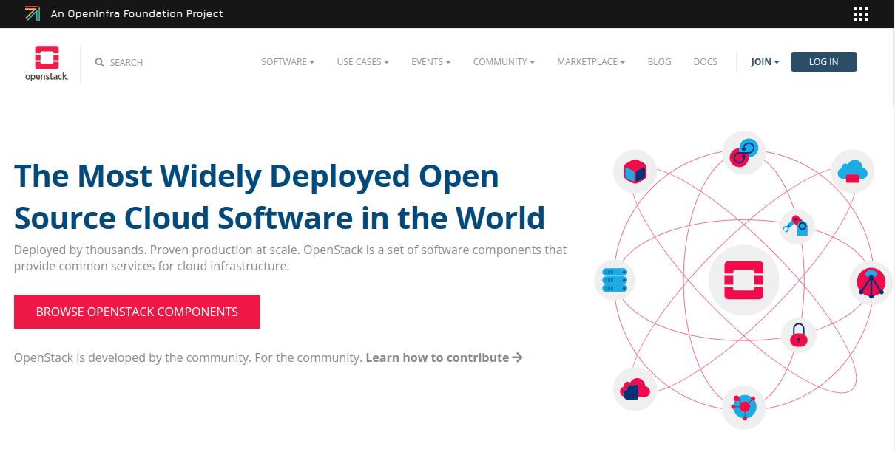

# OpenStack Summary

OpenStack is an open-source cloud computing platform that enables organizations to build and manage private and public clouds. Originally developed by NASA and Rackspace, OpenStack provides a suite of interconnected services that work together to deploy virtualized infrastructure (IaaS) resources such as compute, storage, and networking.

[https://www.openstack.org/](https://www.openstack.org/)

## Key Components of OpenStack:
1. **Nova** – Manages and provisions virtual machines and other compute resources.
2. **Neutron** – Provides networking services, including IP management, VLANs, and firewalling.
3. **Swift** – Object storage system for storing and retrieving unstructured data (e.g., backups, media).
4. **Cinder** – Block storage management for persistent storage to be attached to virtual machines.
5. **Keystone** – Identity service providing authentication and authorization.
6. **Glance** – Manages images used to provision virtual machines.
7. **Horizon** – Web-based dashboard for managing OpenStack resources.

*Image Credit: [docs.redhat.com](https://docs.redhat.com/en/documentation/red_hat_openstack_platform/9/html/architecture_guide/components#Components)*

## Service type

| Service                 | Code       | Description                                                                                   |
|-------------------------|------------|-----------------------------------------------------------------------------------------------|
| **Dashboard**            | horizon    | Web browser-based dashboard that you use to manage OpenStack services.                         |
| **Identity**             | keystone   | Centralized service for authentication and authorization of OpenStack services and for managing users, projects, and roles. |
| **OpenStack Networking** | neutron    | Provides connectivity between the interfaces of OpenStack services.                           |
| **Block Storage**        | cinder     | Manages persistent block storage volumes for virtual machines.                                |
| **Compute**              | nova       | Manages and provisions virtual machines running on hypervisor nodes.                          |
| **Image**                | glance     | Registry service that you use to store resources such as virtual machine images and volume snapshots. |
| **Object Storage**       | swift      | Allows users to store and retrieve files and arbitrary data.                                  |
| **Telemetry**            | ceilometer | Provides measurements of cloud resources.                                                     |
| **Orchestration**        | heat       | Template-based orchestration engine that supports automatic creation of resource stacks.      |

## Benefits of OpenStack:
- **Scalability**: Supports small to large-scale cloud deployments with on-demand resource scaling.
- **Flexibility**: Offers multi-hypervisor support (KVM, VMware, Hyper-V) and integrates with various storage and networking solutions.
- **Community-Driven**: Backed by a strong open-source community, enabling constant improvements and adaptability.

## Typical Use Cases:
- **Private Cloud Infrastructure**: Allows enterprises to run private clouds to manage internal resources.
- **Telecommunications**: Provides a foundation for network functions virtualization (NFV) for telcos.
- **Public Cloud Providers**: Some providers use OpenStack to offer public cloud services.

## Installation and Deployment:
OpenStack can be installed via various methods, including DevStack (for testing), OpenStack-Ansible, and distribution packages from vendors. It’s often used in environments where full control over infrastructure and customization is needed, making it ideal for large organizations, research institutions, and telecommunication companies.
